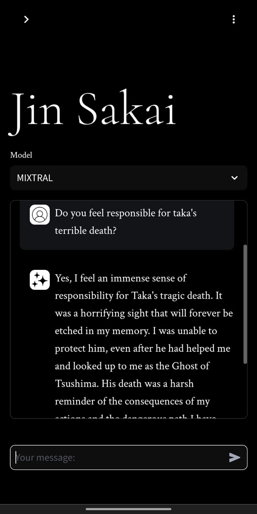

  <h1>Sawaal Jawab</h1>
    <b>Experience Conversations with Famous Personalities Like Never Before</b>

---

**Sawaal Jawab** is a [Llama Index](https://www.llamaindex.ai/) and FastAPI based RAG (Retrieval-Augmented Generation) application that brings you face-to-face with your favorite personalities, allowing you to engage in captivating conversations and ask them anything you desire. Powered by [Groq](https://groq.com/) as LLM and advanced RAG techniques achieved with [Llama Index](https://www.llamaindex.ai/), this project aims to adapt the personality's information from a provided URL, creating a dynamic and immersive Q&A experience.

## Features

- **Personality Adaptation:** Sawal Jawab seamlessly adapts to any personality's information provided via a URL, allowing you to interact with a wide range of famous individuals, from celebrities to thought leaders.
- **Advanced RAG Techniques:** Using techniques like Hybrid Search, colBERT Reranking, Query Expansion to retreive the most relevant context achieved with the help of [Llama Index](https://www.llamaindex.ai/)   
- **Interactive Q&A:** Engage in real-time conversations powered by [Groq](https://groq.com/) with your favorite personalities, asking them questions and receiving thoughtful and personalized responses.

## Screenshots

*Home Page*

*Add Personality*

*Ex 1: Jin Sakai from Ghost of Tsushima*

*Ex 2: Arthur Morgan from RDR2*

*Mobile Preview*

*Mobile Preview*

## TODO

- [x] **User Interface:** A user-friendly web interface for Sawaal Jawab is currently in development. This will allow users to interact with the application through a smooth and appealing UI.

## Prerequisites
- [Qdrant](https://qdrant.tech/): Main Vector Database used for storing and retreiving context.
- [Ollama](https://ollama.com/): Used for generating embeddings from 'mxbai-large' model for vector database.
- [Groq API](https://groq.com/): Utilized as the Large Language Model (LLM) provider for generating responses.

## Getting Started

To get started with Sawal Jawab, follow these steps:

### Clone Repo
1. Clone the repository: `git clone https://github.com/azain47/sawaal-jawab.git`
2. Navigate to the project directory: `cd sawaal-jawab`
### Create a Conda Environment
3. Install dependencies: `conda create --name <env> --file requirements.txt`
4. Activate the env: `conda activate <env>`
### Run the FastAPI app
5. Edit the .env file with `GROQ_API_KEY = <your-api-key>`
6. Run the command : `fastapi dev app.py` or `fastapi run app.py`
7. Open the browser window and type `http://localhost:8000`
8. You can interact with the API using tools like Postman, Bruno, or the built-in Swagger UI (`http://localhost:8000/docs`).
### Run the Streamlit UI
9. Run the command : `streamlit run ui.py`
10. Open the browser window with the url `http://localhost:8501`
11. Add a personality with a name and any wiki page with their info
12. *Start asking questions and enjoy the conversation!*
## Contributing

*Contributions from the community are always welcomed!!*

  Made with ❤️ by Azain!

